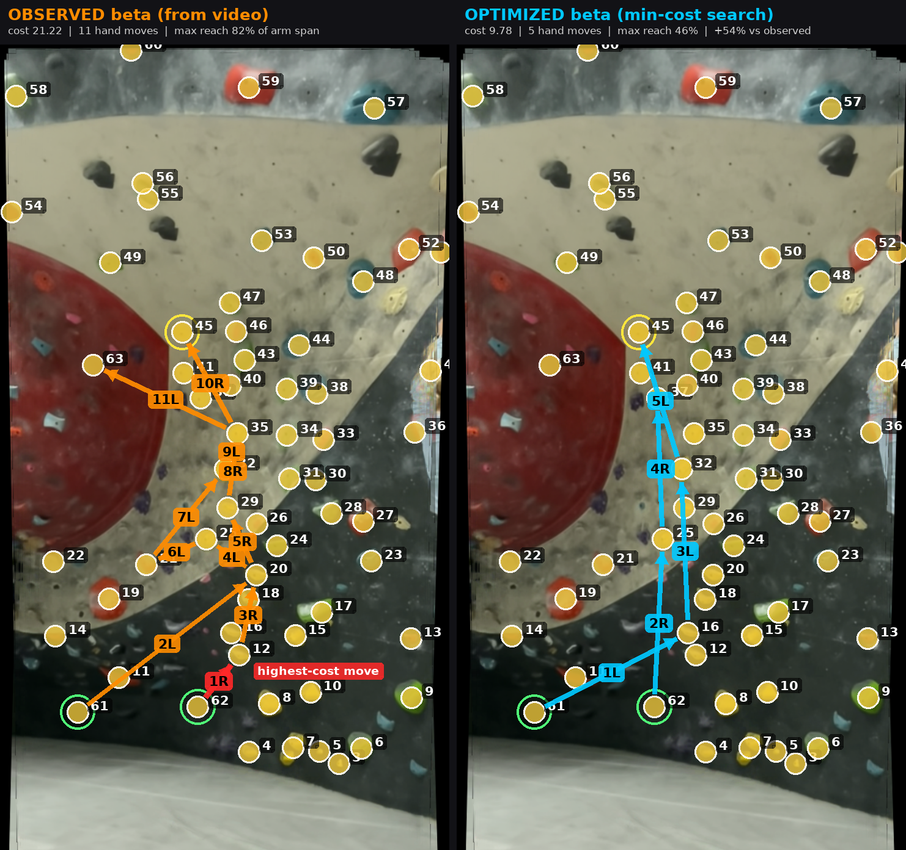
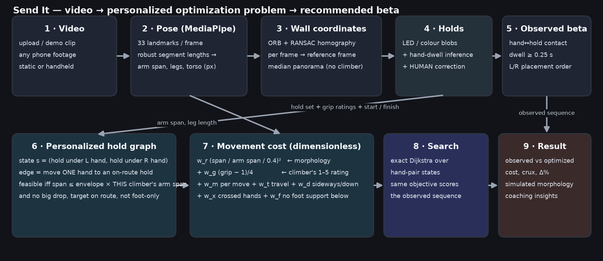
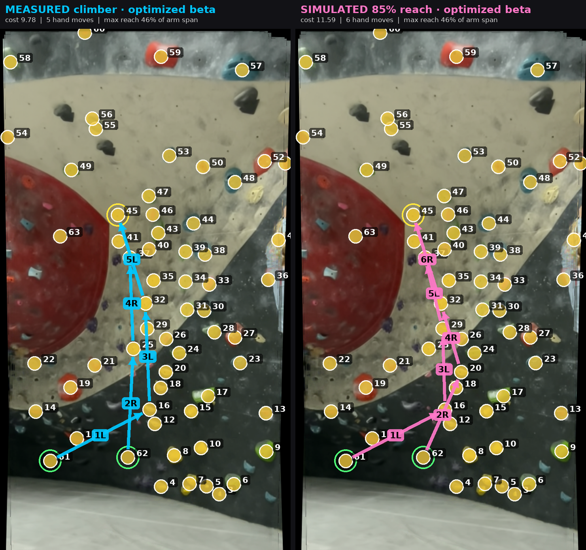
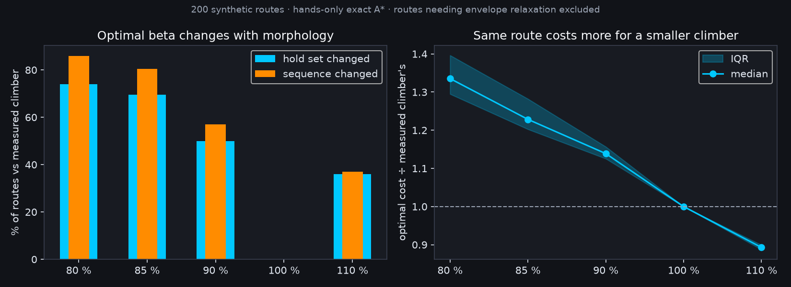

# Send It

## Personalized Climbing Beta Optimization — HackCMU 2026 · Optimization track

> Traditional climbing grades describe the route. **Send It optimizes the route for the person climbing it.**

Send It turns a phone video of a climb into a **personalized optimization problem**: computer vision extracts the
climber's body proportions, the holds, and the sequence they actually climbed; we build a climber-specific hold graph
with a movement-cost function; and an exact graph search returns the **minimum-cost beta for that climber**, side by
side with what they actually did — and why it differs.



*Own footage, handheld phone, dense spray wall. Left: the 11 hand moves the climber made (orange), highest-cost move in
red. Right: the optimizer's 5-move line for the same climber (cyan). Total movement cost 21.2 → 9.8 (−54 %) under
the same objective; peak reach 82 % → 46 % of arm span.*

---

### Problem

A route has one grade, but climbers don't have one body. A move that is a comfortable lock-off for a 190 cm climber
can be a full-extension dyno for a 160 cm climber, and the *best sequence of holds* — the beta — changes with the
body doing it. Today climbers learn beta by watching someone else, who usually has a different body.

### Why grades aren't personalized

Grades are set by the route-setter's body and consensus. Existing climbing-CV tools (pose overlays, hold detectors,
"movement smoothness" scores) **analyze what happened**. None of them **recommend what should have happened for you**.

### What Send It does

1. Extracts pose (MediaPipe) and a calibration-free estimate of the climber's **arm span, leg length and torso**.
2. Registers every frame to one **wall coordinate frame** (ORB features + RANSAC homography), so handheld footage works
   and a clean, climber-free panorama of the wall is produced for hold detection and for the UI.
3. Detects holds (lit LEDs on a Kilter-style board, or saturated colour blobs on a normal wall), **infers holds from
   where the climber's hands dwelled**, and lets a human **add / move / remove / rate** them.
4. Recovers the **observed hand sequence** from hand–hold contact dwell.
5. Builds a **personalized hold graph**, assigns every possible hand move a cost, and finds the **minimum-cost beta**
   with exact Dijkstra search.
6. Shows **observed vs optimized**, the predicted crux, a cost breakdown, coaching insights, and what changes when the
   climber's morphology is scaled ("same route, shorter climber").

### Pipeline

```
Video → Pose → Wall coordinates → Holds → Human correction → Observed beta
      → Personalized hold graph → Movement cost → Dijkstra → Recommended beta → Observed-vs-optimized comparison
```



---

### Optimization formulation

**State.** `s = (h_L, h_R)` — the hold under the left hand and under the right hand (`h_L = h_R` when matched).

**Action / edge.** Move **one** hand from its hold to another on-route hold `b` while the other hand stays on `c`.

**Feasibility (personalized).** An edge exists iff

* `dist(c, b) / arm_span ≤ ρ_max` — the hand-to-hand span after the move fits the climber's **reach envelope**
  (default `ρ_max = 0.85`; automatically widened to any span the climber demonstrably performed on video),
* the moving hand does not drop more than `0.2 × arm_span`,
* `b` is on the route and not marked foot-only.

**Movement cost (per move, dimensionless).**

```
C(a→b | c, climber) = w_r · ( (dist(c,b)/arm_span) / 0.4 )²      reach, normalized to THIS climber (quadratic)
                    + w_g · (grip(b) − 1) / 4                    grip-quality penalty, user rating 1..5
                    + w_m                                        per-move penalty (every re-grip costs something)
                    + w_t · dist(a,b)/arm_span                    travel of the moving hand
                    + w_d · sideways/downward component           direction (0 for a straight-up move)
                    + w_x · crossed-hands amount                  crossed hands after the move
                    + w_f · foot-support deficit(b)               no hold inside the climber's leg window below b
```

Defaults: `w_r=1, w_g=0.8, w_m=0.35, w_t=0.25, w_d=0.4, w_x=0.5, w_f=0.4` (all live sliders in the UI).

**Objective.** Minimize the sum of move costs from the observed start state to any state with a hand on the finish
hold (optionally both hands). **Algorithm:** exact Dijkstra over the implicit hand-pair state graph (`|V| ≤ n²`,
edges generated on the fly; milliseconds for n ≈ 60 holds). If the graph is disconnected under the envelope, the
envelope is relaxed in 0.05 steps and the relaxation is reported.

**Apples to apples.** The climber's observed sequence is scored with the *same* cost function, so
`improvement = (observed − optimized) / observed` is a like-for-like comparison, and the highest-cost observed move is
reported as the **predicted crux** with its cost drivers.

**Why graph search and not the shortest geometric path?** Because the shortest path in pixels ignores the climber
(reach normalization), the holds (grip ratings), and the number of re-grips. The UI shows the geometric baseline
scored under our objective for contrast.

### Four-limb mode (hands + feet)

The same graph machinery runs over the full limb state `s = (h_L, h_R, f_L, f_R)` when the *Full-body plan* toggle
is on (a foot may be `None` = cut loose / smearing):

* **Feet feasibility.** Every placed foot must sit inside the climber's leg window below the hands' midpoint
  (0.35–1.25 × body-height proxy vertically, ±0.6 laterally, from their measured legs + torso), both feet within
  1.3 × leg length of each other, evaluated after every move — so rising hands eventually force the feet up.
  Feet may use any on-route hold, foot-only holds included. Below the lowest holds the feet are assumed to be on
  the ground (the model cannot see the mat).
* **Costs.** Hand moves keep the same terms, but the foot-support proxy becomes the actual support deficit after the
  move, plus a *cut-loose* penalty for moving a hand with the feet off (`w_hang`). Foot moves cost a fixed
  `w_fmove` + travel / leg length + half the grip penalty + a crossed/matched-feet term.
* **Search.** The joint space is `hand pairs × foot pairs` (~40k states on the spray-wall demo, ~400 on the Kilter
  route). Below a size threshold we run exact A* (admissible bound: remaining moves × per-move cost); above it a
  budgeted A* that falls back to diversity-capped beam search, reported on screen as *approximate* with the beam
  width. Demo results are precomputed (`scripts/build_demo_cache.py`) so the toggle is instant; a live re-search
  after an edit takes ~15 s exact or ~1 s with the beam option.
* **Observed feet** are measured from toe/ankle landmarks and drawn where a foot was on a detected hold; the
  hands-only observed-vs-optimized numbers remain the headline because foot detection is incomplete on real walls.

### Human-in-the-loop computer vision

CV is imperfect in arbitrary gyms: dark holds on a dark panel, painted wall features, occlusion, lens perspective.
Instead of failing silently, every failure-prone stage has a manual override:

* **Hold set** — click to add, remove, move; toggle route membership; mark start / finish / foot-only.
* **Hold inference from behaviour** — holds the detector missed but the climber's hands dwelled on are proposed
  automatically (`source = dwell`). In the spray-wall demo the two dark start holds were recovered this way.
* **Grip rating** — a 1–5 subjective quality score per hold that feeds the objective.
* **Wall type** — auto (lit-pixel fraction inside the dark board mask), lit board, or normal wall.
* **Route colour filter** — set routes are usually one colour; keep only those holds on route in one click.
* The observed sequence is re-derived from the corrected hold set at the press of a button.

Workflow: **automatic detection → human correction → optimization**, and the corrected set can be saved as the
curated hold set for that video.

### Hold quality (grip score)

`1 = excellent / very secure · 2 = good · 3 = average (default) · 4 = poor · 5 = terrible`. Converted to a penalty
`(grip − 1)/4 ∈ [0, 1]` on entering the hold. It is a **user preference input, not ground truth**; its role is to
express that the geometric shortest path is not necessarily the easiest beta — a longer reach to a jug can beat a
short reach to a terrible sloper.

### Personalization

All reach terms are ratios to the climber's **own** arm span (measured from the video), so the same wall distance is
more expensive — or infeasible — for a smaller climber. The UI's *Personalize* tab scales the measured morphology
(70–125 %) and re-runs feasibility and search:



*Same route, same holds. Measured climber: 5 moves. Simulated 85 % reach: the optimizer re-routes through H20 and
H29 (6 moves, cost 9.8 → 11.6). Labelled as a simulation — no second real climber is implied.*

### Does morphology change the beta? (synthetic benchmark)

`scripts/benchmark_morphology.py` generates 200 random routes (7×5 hold grid with jitter, random 1–5 grips, matched
start at the bottom, finish at the top) and solves each exactly for a climber scaled to 80–110 % of the measured arm
span and legs. No route needed envelope relaxation, so every comparison is exact-vs-exact under the same objective.

| simulated reach | optimal hold set changed | sequence changed | cost ÷ measured (median, IQR) |
|---|---|---|---|
| 80 % | 74 % | 86 % | 1.34 (1.29–1.40) |
| 85 % | 70 % | 80 % | 1.23 (1.20–1.28) |
| 90 % | 50 % | 57 % | 1.14 (1.13–1.16) |
| 110 % | 36 % | 37 % | 0.89 (0.89–0.90) |



Reading it: shrink the climber by 15 % and the *optimal hold set itself* changes on 70 % of routes while the cost of
the route rises by ~23 %; even a 10 % taller climber gets a different line on a third of routes. Beta is a property
of the climber–route pair, which is the premise of the project.

### Demo

Two demo climbs ship with **cached analysis computed by this pipeline** (so judging doesn't depend on a 20-second
live run), plus live re-run and upload modes:

| Demo | Footage | What it shows |
|---|---|---|
| Spray wall | own phone footage, handheld | camera-motion compensation, 61 detected/inferred/curated holds, 11-move observed beta vs 5-move optimized beta, morphology re-routing |
| Kilter-style LED board | public CruxCam dataset (static camera) | objective route membership from lit holds; full-route plan for measured vs simulated climber |

**Three reliability layers.** (1) Live: upload → full pipeline (≈ 20–30 s). (2) Demo: the same pipeline's cached
output loads instantly and every edit/slider re-optimizes live. (3) Emergency: pre-rendered results
(`demo_assets/<demo>/comparison.png`, `diff.png`, `graph.png`, `personalize.png`) and browser screenshots
(`docs/screenshots/`). A 3-minute script (`docs/PRESENTATION.md`), judge Q&A (`docs/JUDGE_QA.md`) and submission blurb
(`docs/SUBMISSION.md`) are included. `scripts/ui_screenshots.py` drives the running app with Playwright (tabs, hold
click-select, demo switch, upload) and regenerates the screenshots.

### Installation

```bash
python3 -m venv venv && source venv/bin/activate
pip install -r requirements.txt
```

`protobuf` is pinned to 4.25.x on purpose: MediaPipe 0.10.14 (chosen because it needs no model download at runtime)
breaks with protobuf ≥ 5. If you install anything else afterwards, re-run `pip install protobuf==4.25.9`.

### Running

```bash
streamlit run app.py                       # UI (loads the cached demos instantly)
python3 scripts/build_demo_cache.py        # rebuild demo caches + fallback images (--force to recompute CV)
python3 -m pytest tests -q                 # optimizer sanity tests
```

Live processing of a 25 s 1080p-ish phone clip takes ≈ 20 s on a laptop (pose ≈ 9 s, stabilization ≈ 8 s); the
optimization itself is milliseconds, so every slider, rating and hold edit re-optimizes instantly.

### Architecture

```
sendit/
  pose.py        MediaPipe extraction; robust-percentile morphology (arm span, legs, torso)
  stabilize.py   ORB+RANSAC homographies → wall coordinates; climber-free median panorama
  holds.py       LED / colour hold detection, hand-dwell hold inference, hold schema
  beta.py        hand–hold contact events → observed placement sequence (+flicker cleanup)
  optimizer.py   Climber / Weights / Feasibility, move cost, Dijkstra over hand-pair states,
                 observed-sequence scoring, comparison, crux explanation
  viz.py         judge-readable renderings (observed vs optimized, diff, feasibility graph, overlay video)
  coach.py       rule-based coaching insights (+ optional LLM paraphrase, never decides the beta)
  pipeline.py    caching orchestration: analyze_video(), run_optimization()
app.py           Streamlit UI: Route & holds · Climber · Optimize · Personalize · Method
tests/           deterministic optimizer tests (grip flips the beta, morphology flips feasibility, comparison math)
scripts/         build_demo_cache.py
src/             original analytics prototype (pose pipeline, LED detector reused; the rest kept for reference)
```

### Limitations (honest scope)

* **Hands first.** The headline comparison is the hand-pair state; the four-limb plan adds feet under a simple leg
  window and is exact only below a state-count threshold (approximate beam search above it, labelled as such).
  Torso/hip position is not an explicit state variable.
* **Heuristic objective.** Costs are dimensionless heuristics, not energy, force, fatigue or injury risk. Weights are
  defaults we tuned to produce human-like betas, not fitted parameters.
* **2D pose.** Landmarks are image-plane; perspective and wall curvature bias distances (a hold near the camera looks
  farther in pixels). Ratios within one video are consistent; cross-video comparison needs a shared scale.
* **Hold detection** is colour/LED based; dark holds on dark panels, painted features and lens flare need the manual
  editor (that's why it exists). Camera registration assumes a roughly planar wall.
* **Grip ratings are subjective** and default to neutral.
* **Morphology simulation** scales all measured segments uniformly; it is labelled as simulated.

### Future work

* Hip/torso as a state variable, support-polygon reasoning, whole-body transition costs on top of the four-limb graph.
* **Learned edge costs** from many successful climbs (imitation / inverse RL), replacing hand-tuned weights.
* 3D pose (multi-view or depth) and metric calibration for cross-video comparison.
* Gym-scale hold maps and route recommendation by morphology; longitudinal athlete modelling.

### Credits

Kilter-board demo footage: the public [CruxCam](https://github.com/scobi7/CruxCam) dataset. Closest prior art on
hand-sequence prediction: BetaMove (beam search over MoonBoard hand states, no body-size normalization); Send It adds
measured morphology, exact search, human-in-the-loop CV and camera registration.
